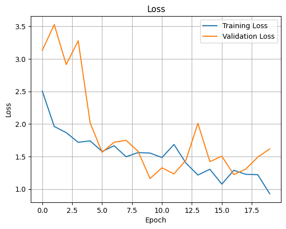

# CNN-Based Animal Image Classification

This project utilizes a Convolutional Neural Network (CNN) to classify animal images into 10 distinct classes. The model is tested against real-world data manipulations such as brightness and contrast changes to assess its robustness.

---

## Project Overview

The aim of this project is to classify images of animals using a CNN-based model trained with augmented data. The performance is evaluated under normal conditions, manipulated conditions (e.g., brightness changes), and after applying a gray-world color constancy algorithm.

## Key Results

| Test Condition                          | Accuracy |
|-----------------------------------------|----------|
| **Original Test Set**                   | 55.18%   |
| **Manipulated Test Set**                | 10.36%   |
| **Color Constancy Adjusted Test Set**   | 10.36%   |

**Training Results:**
- Training Accuracy: **71.88%**
- Validation Accuracy: **43.33%**

---

## Dataset

- **Source**: [Animals with Attributes 2](https://www.kaggle.com/datasets/rrebirrth/animals-with-attributes-2)
- **Classes**: Collie, Dolphin, Elephant, Fox, Moose, Rabbit, Sheep, Squirrel, Giant Panda, Polar Bear
- **Images per class**: 650
- **Total Images**: 6500 (128x128 resolution, normalized)

---

## Key Steps

### 1. Data Preprocessing
- Resizing all images to 128x128.
- Normalizing pixel values between 0 and 1.

### 2. Data Augmentation
Applied the following transformations using `ImageDataGenerator`:
- Rotation (20 degrees)
- Width and height shifts (0.1)
- Horizontal flips
- Brightness adjustments (0.8–1.2)
- Added Gaussian noise

### 3. Color Constancy Adjustment
The gray-world algorithm was applied to the manipulated test set to balance color shifts. This technique aims to standardize brightness and color variations caused by external factors.

### 4. Model Architecture
- **Convolutional Layers**: Extracted features with filters of size (3x3).
- **Batch Normalization**: Improved convergence and regularization.
- **Max Pooling Layers**: Reduced spatial dimensions.
- **Fully Connected Layers**: Dense layers for final classification.
- **Dropout**: Prevented overfitting with a 0.5 dropout rate.

**Summary:**
- Total Parameters: 6,550,602
- Optimizer: Adam
- Loss Function: Categorical Crossentropy

---

## Visualizations
### Accuracy and Loss Graphs
- **Accuracy Graph:** Displays the training and validation accuracy over epochs.
- **Loss Graph:** Displays the training and validation loss over epochs.




---

## Example Predictions

| Predicted Class | Confidence |
|-----------------|------------|
| Elephant        | 85%        |
| Rabbit          | 78%        |

---

## Installation and Usage

### Prerequisites
Install the required Python libraries:
```bash
pip install tensorflow opencv-python matplotlib scikit-learn
```

### Running the Notebook
1. Clone the repository:
   ```bash
   git clone https://github.com/yourusername/CNN-Animal-Classification.git
   ```
2. Navigate to the project directory:
   ```bash
   cd CNN-Animal-Classification
   ```
3. Install dependencies:
   ```bash
   pip install -r requirements.txt
   ```
4. Open the Jupyter Notebook or Python script:
   ```bash
   jupyter notebook notebook.ipynb
   ```

---

## Future Work
- Implement additional preprocessing techniques (e.g., adaptive histogram equalization).
- Use advanced data augmentation techniques.
- Apply transfer learning with pretrained models such as VGG16 or ResNet.
- Optimize the CNN architecture to improve validation accuracy.

---

## License
This project is licensed under the MIT License. For more details, please refer to the [LICENSE](./LICENSE) file.

---

## Contributors
- **[N. Begüm Aydoğdu](https://github.com/friednoodles777)** - Developer and Documentation


---

## Limitations
- The model struggles with heavily manipulated data (accuracy drops significantly).
- Limited to 10 classes; performance on other classes is not evaluated.
- Sensitivity to brightness and contrast manipulations highlights a potential gap in robustness.

---
